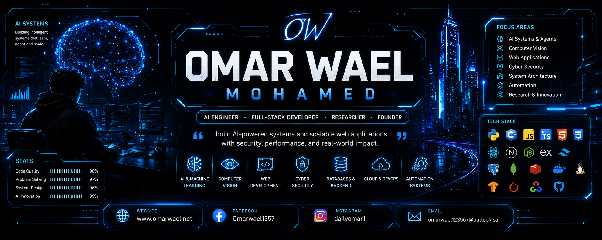

<!-- FAANG STYLE GITHUB PROFILE -->

  
### AI Engineer • Full-Stack Developer • Independent Researcher • Founder

 

<!-- SOCIAL LINKS -->

---

##  About Me

I am an **AI Engineer & Full-Stack Systems Developer** focused on building intelligent, scalable, and secure software systems.

I work at the intersection of:

- Artificial Intelligence & Machine Learning  
- Computer Vision & Real-Time Systems  
- Full-Stack Web Applications  
- Cybersecurity & Secure Architecture  
- Startup & Product Engineering  

> I build systems that don’t just run — they learn, scale, and evolve.

---

##  Startups & Projects

* Veil Agency — A creative marketing agency that builds strong, stealth-driven brands and delivers high-impact digital growth strategies.

* CyperLife — A futuristic cyber-tech company specializing in AI systems, automation, and advanced digital intelligence solutions.

* Astra Dynamics — An innovation and engineering company focused on space technology, energy systems, and smart tech solutions.

* Oxium — A modern technology brand focused on high-performance systems, scalable digital infrastructure, and advanced tech solutions.
---

##  Tech Stack

### Core

### Web Development

### Backend & Databases

### AI / ML

### Cybersecurity & Infra

### Hardware & Electronics
Arduino • PCB Design • Embedded Systems • Circuit Design

### Robotics & Automation
Robotics • Sensors Integration • Motor Control • IoT Systems • Control Systems

### Assembly & Hardware Building
Circuit Assembly • Wiring • Prototyping • Hardware Debugging

### Programming
Python • C++ • Embedded C • Arduino IDE

---

## 📊 GitHub Analytics

---

## Focus Areas

- AI Systems & Agents  
- Computer Vision (Real-Time Recognition)  
- Scalable Web Platforms  
- Secure API & System Architecture  
- Automation & Data Engineering  
- Startup Product Development  

---

##  Links

- 🌍 Website: https://omarwael.net
- 💼 LinkedIn: https://linkedin.com/in/Omarwael123
- 📸 Instagram: https://instagram.com/dailyomar1 
- 📧 Email: omarwael123567@outlook.sa

---

## 🏁 Philosophy

> “I don’t build software. I build intelligent systems that scale like companies.”

---

### ⭐ Building the future with AI, systems, and startups

